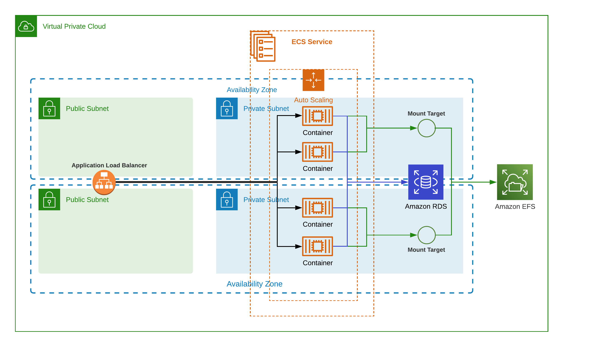

# WordPress su ECS

## Scopo
Questo progetto ha l'obiettivo di distribuire un'applicazione WordPress sicura, veloce, tollerante ai guasti e scalabile su AWS ECS. Il provisioning dell'infrastruttura può essere effettuato utilizzando lo strumento preferito (Terraform).

## Obiettivi
L'obiettivo è progettare e, dove possibile, implementare la seguente infrastruttura:
1. **Cluster ECS**:
   - Includere tutte le risorse di rete necessarie.
2. **Applicazione WordPress**:
   - **Application Load Balancer (ALB)**:
     - Accessibile pubblicamente.
     - Instrada il traffico verso l'applicazione WordPress.
   - **Applicazione WordPress**:
     - Esegue su ECS.
     - Includere un Dockerfile.
     - Parametrizzare la versione di WordPress.
3. **Allarme CloudWatch**:
   - Creare almeno un allarme CloudWatch adatto per un ambiente di produzione.

## Requisiti
Gli strumenti e le tecnologie seguenti sono richiesti per completare il progetto:
- **Strumento di provisioning dell'infrastruttura**:
  - Terraform.
- **Bash**:
  - Per scripting.

## Deliverables
- Progetto dell'infrastruttura utilizzando lo strumento di provisioning scelto.
- Dockerfile per l'applicazione WordPress.
- Configurazione dell'allarme CloudWatch.
- (Opzionale) Uno script funzionale o un set di script che dimostrano il setup.

## Obiettivi Bonus
Funzionalità aggiuntive per guadagnare punti bonus:
1. **Best Practices di Sicurezza**:
   - Implementare almeno 5 best practices nell'infrastruttura.
2. **Raccolta Log**:
   - Raccogliere i log per l'applicazione WordPress.
3. **Politiche di Auto-scaling**:
   - Definire configurazioni di auto-scaling per il cluster ECS o l'applicazione WordPress.
4. **Pipeline CI/CD**:
   - Creare una pipeline per l'applicazione WordPress utilizzando:
     - AWS CodePipeline
     - GitHub Actions
     - GitLab CI/CD
5. **Diagramma Architetturale**:
   - Illustrare la configurazione dell'infrastruttura.

## Descrizione della Soluzione
L'infrastruttura è composta dai seguenti componenti:
1. **VPC**:
   - 3 subnet pubbliche.
   - 3 subnet private.
   - Endpoint per contattare i servizi AWS senza passare dal pubblico.
2. **EC2 Instance**:
   - Utilizzata per eseguire `docker pull` e pushare automaticamente l'immagine su ECR.
3. **ECS Cluster**:
   - Distribuito sulle subnet private.
4. **Application Load Balancer (ALB)**:
   - Utilizzato come punto di accesso pubblico per l'applicazione WordPress.

### Problemi Attuali
Ad oggi, WordPress non funziona correttamente in quanto sembra che la root di WordPress non sia `/`. Non ho avuto il tempo né il modo di debuggarlo ulteriormente.

## Diagramma dell'Infrastruttura
Questo e come avrei creato l'infra per un sito non statico, ad oggi l'attuale infra non tiene conto di EFS e RDS


## Istruzioni per l'Installazione
1. Clonare il repository:
   ```sh
   git clone https://github.com/MarouaneElBostahi/claranetprj.git
   cd wordpress-ecs
   terraform init
   terraform plan
   terraform apply
   ```